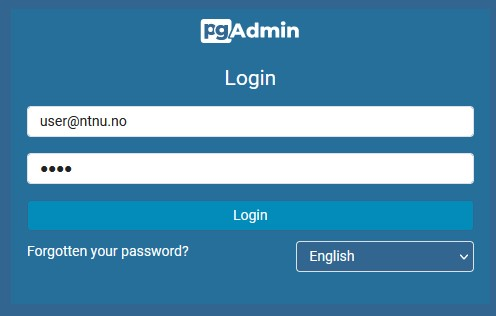
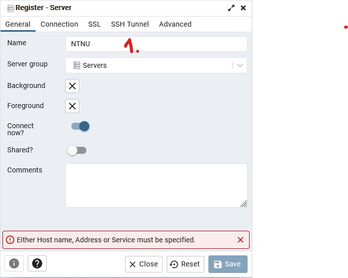
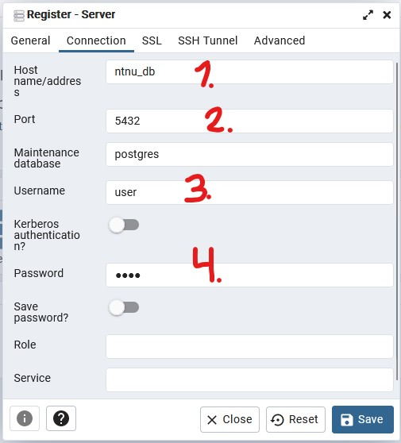

# Postgres docker compose

1. Clone repo

`git clone git@github.com:eiriksfa/ntnu-postgres.git`

2. Start dockerhub/docker service (if not running)
3. When in repo folder, start docker compose

`docker compose up -d`

4. Open browser and go to localhost:8080 and login to pgadmin

The username and password is defined in the docker-compose.yml file, under the pgadmin service.
Default: user@ntnu.no : ntnu

5. Connect to postgres database (required fields are marked in red)

Database name (any)

* Hostname/address is the same as "container_name" of the postgresdb service.
* username and password is defined in the environment part of postgresdb service in the docker-compose.yml file

